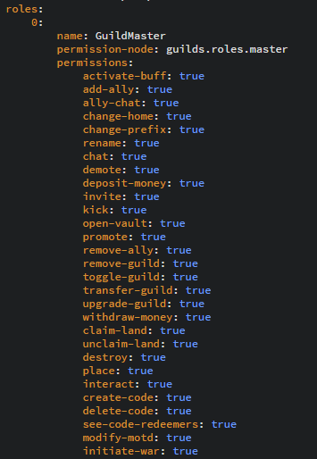

# Fully Customizeable Roles

A big part of how this plugin works is the roles that are in each guild. You are essentially given unlimited flexibility and specialization over your server. You can customize the name of every role, their permission nodes, and what privileges they will have. You choose what you want to do, to give your users the best experience they can have on your server!

#### Example Role

As you can see in the picture below. This is an example of the GuildMaster \(leader\) role. 

For each role, you can customize the name, the permission node of the role, and all the permissions that they have within the guild itself!

