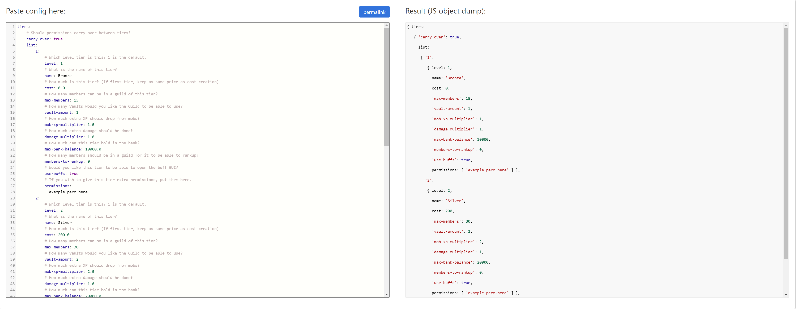
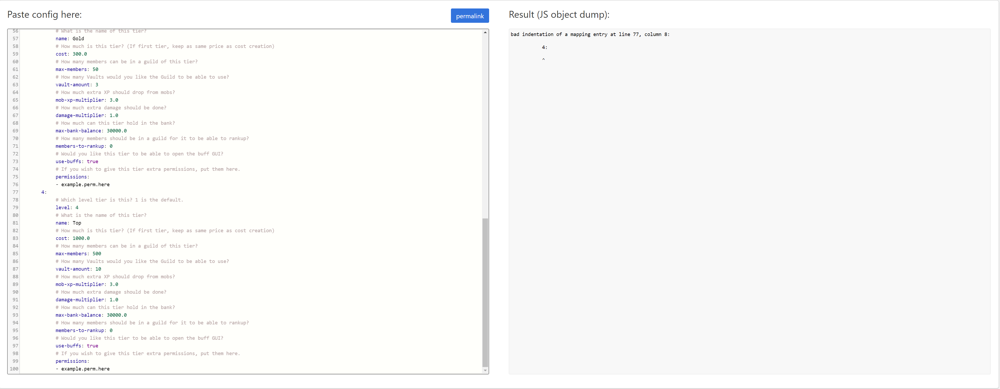

# Guild Tiers

You can think of tiers just like you can a level. In any MMORPG games, you have levels, whether it be a skill, or your character's level. Just like that, we have the same thing here with Guilds! Each Guild starts off on the first level/tier. Players can work together in their Guild to raise money in order to be able to upgrade it. You have full control over what perks a tier gets. You can give them more Mob EXP, Mob Damage, Permissions, and so much more! Tiers are a great incentive for players to continue to work hard on your server and unlock all the perks they can!

### Adding More Tiers

Adding more tiers is super easy! In this tutorial, we will be referencing the preview of the config.yml seen below. All the tiers are in their own part of the config, as you can see, in the tiers section, you first have the option about carrying perms over when guilds upgrade, that's a personal choice!

In this part, we want to work on adding a new tier to the config!

The easiest way to add a new tier to the config is to just copy an existing one since we know they already work on the server!

Here's the tier we will copy to create a new one in the config:

```yaml
        1:
            # Which level tier is this? 1 is the default.
            level: 1
            # What is the name of this tier?
            name: Bronze
            # How much is this tier? (If first tier, keep as same price as cost creation)
            cost: 0.0
            # How many members can be in a guild of this tier?
            max-members: 15
            # How many Vaults would you like the Guild to be able to use?
            vault-amount: 1
            # How much extra XP should drop from mobs?
            mob-xp-multiplier: 1.0
            # How much extra damage should be done?
            damage-multiplier: 1.0
            # How much can this tier hold in the bank?
            max-bank-balance: 10000.0
            # How many members should be in a guild for it to be able to rankup?
            members-to-rankup: 0
            # Would you like this tier to be able to open the buff GUI?
            use-buffs: true
            # If you wish to give this tier extra permissions, put them here.
            permissions: 
            - example.perm.here
```

Now, before you just paste it in and be done with it, there's a few things that we need to do:

1. First off, realize that there is some spacing that comes with the tiers. There's a chance it might copy weird so it's important the spacing and indentation looks like the rest
2. Next, we need to change the `1:` because of the way some code works, it would see it as a double entry and freak out. So, if we're making this the 4th tier, let's change the `1:` to `4:` . With that, also don't forget to change the actual `level: 1` to `level: 4` also so that the plugin will know this is the 4th tier a guild can achieve
3. Then, configure to your hearts desire! Change the name, the cost, etc!
4. Finally, **make a backup!** We don't want all this hard work to go to waste. 

**Successful Tip \#1:**

Manually making sure that the spacing is correct in the new tier can be hard! That's why we have a tool that can help you! If you copy and paste the config with the new tier on this website [https://yaml.helpch.at](https://yaml.helpch.at) it will show you if it's correct or not. Refer to the images below to know if it's correct or not!

**Correct**



**Incorrect**



Referring to the **config.yml**, this is what the default tiers look like:

```yaml
tiers:
    # Should permissions carry over between tiers?
    carry-over: true
    list:
        1:
            # Which level tier is this? 1 is the default.
            level: 1
            # What is the name of this tier?
            name: Bronze
            # How much is this tier? (If first tier, keep as same price as cost creation)
            cost: 0.0
            # How many members can be in a guild of this tier?
            max-members: 15
            # How many Vaults would you like the Guild to be able to use?
            vault-amount: 1
            # How much extra XP should drop from mobs?
            mob-xp-multiplier: 1.0
            # How much extra damage should be done?
            damage-multiplier: 1.0
            # How much can this tier hold in the bank?
            max-bank-balance: 10000.0
            # How many members should be in a guild for it to be able to rankup?
            members-to-rankup: 0
            # Would you like this tier to be able to open the buff GUI?
            use-buffs: true
            # If you wish to give this tier extra permissions, put them here.
            permissions: 
            - example.perm.here
        2:
            # Which level tier is this? 1 is the default.
            level: 2
            # What is the name of this tier?
            name: Silver
            # How much is this tier? (If first tier, keep as same price as cost creation)
            cost: 200.0
            # How many members can be in a guild of this tier?
            max-members: 30
            # How many Vaults would you like the Guild to be able to use?
            vault-amount: 2
            # How much extra XP should drop from mobs?
            mob-xp-multiplier: 2.0
            # How much extra damage should be done?
            damage-multiplier: 1.0
            # How much can this tier hold in the bank?
            max-bank-balance: 20000.0
            # How many members should be in a guild for it to be able to rankup?
            members-to-rankup: 0
            # Would you like this tier to be able to open the buff GUI?
            use-buffs: true
            # If you wish to give this tier extra permissions, put them here.
            permissions: 
            - example.perm.here
        3:
            # Which level tier is this? 1 is the default.
            level: 3
            # What is the name of this tier?
            name: Gold
            # How much is this tier? (If first tier, keep as same price as cost creation)
            cost: 300.0
            # How many members can be in a guild of this tier?
            max-members: 50
            # How many Vaults would you like the Guild to be able to use?
            vault-amount: 3
            # How much extra XP should drop from mobs?
            mob-xp-multiplier: 3.0
            # How much extra damage should be done?
            damage-multiplier: 1.0
            # How much can this tier hold in the bank?
            max-bank-balance: 30000.0
            # How many members should be in a guild for it to be able to rankup?
            members-to-rankup: 0
            # Would you like this tier to be able to open the buff GUI?
            use-buffs: true
            # If you wish to give this tier extra permissions, put them here.
            permissions: 
            - example.perm.here
```

